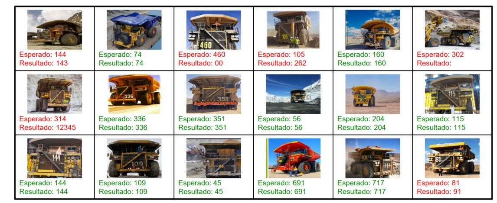

# Mining Truck ID Recognition with PaLiGeMMA 2

Este proyecto implementa un sistema de reconocimiento automático de números identificadores en camiones mineros utilizando el modelo multimodal PaLiGeMMA 2.

## Toda la info de PaliGeMMA 2 en:

https://developers.googleblog.com/en/introducing-paligemma-2-powerful-vision-language-models-simple-fine-tuning/

## los modelos de paligemma2 los puedes descargar desde huggingface

https://huggingface.co/blog/paligemma2 

## Descarga del Modelo

El modelo PaLiGeMMA 2 se puede descargar directamente desde Hugging Face usando el siguiente script:

```python
from huggingface_hub import snapshot_download

# Nombre del modelo en Hugging Face
model_name = "google/paligemma2-3b-pt-448"

# Descargar todos los archivos del modelo
local_dir = snapshot_download(repo_id=model_name)

print(f"Modelo descargado en: {local_dir}")
```

Alternativamente, puedes descargarlo mediante línea de comandos:
```bash
huggingface-cli download google/paligemma2-3b-pt-448 --local-dir ./models/paligemma2-3b-pt-448
```

💡 **Nota**: Asegúrate de tener suficiente espacio en disco, ya que el modelo ocupa varios GB.

 
## Descripción

El sistema procesa imágenes de camiones mineros y extrae automáticamente el número identificador pintado en el costado del equipo. Utiliza PaLiGeMMA 2, un modelo multimodal basado en PaLM que combina procesamiento de texto e imágenes.

## Requisitos

- Python 3.8+
- PyTorch
- Transformers
- OpenCV
- ReportLab
- PIL
- CUDA compatible GPU (Probado en NVIDIA RTX 3060)


## Estructura del Proyecto

```
├── models/
│   └── paligemma2-3b-pt-448/  # Modelo PaLiGeMMA (no incluido en el repo)
├── images/                     # Carpeta con imágenes de prueba
├── main.py                     # Script principal
└── README.md
```

## Uso

1. Coloca las imágenes de los camiones en la carpeta `images/`
2. Ejecuta el script:
```bash
python main.py
```
3. El script generará un PDF con:
   - Visualización de resultados
   - Estadísticas de precisión
   - Lista de errores encontrados

A continuación se muestra un ejemplo de los resultados obtenidos con el modelo:



La imagen muestra el procesamiento de 18 imágenes diferentes de camiones mineros donde:
- Verde: Identificación correcta
- Rojo: Identificación incorrecta o sin resultado
- Se compara el número esperado vs el resultado del modelo

Los resultados muestran que el modelo es capaz de identificar correctamente los números en diferentes condiciones, aunque presenta desafíos con algunos ángulos y condiciones de iluminación específicas.

## Características

- Procesamiento de imágenes de 448x448 píxeles
- Generación de reportes en PDF
- Post-procesamiento de resultados
- Manejo de casos especiales (números prohibidos)
- Estadísticas de precisión

## Consideraciones

Para obtener mejores resultados:
- Las imágenes deben tener buena iluminación
- El número debe ser claramente visible
- Evitar ángulos extremos
- Mantener una distancia consistente

## Limitaciones Conocidas

- Sensible a condiciones de iluminación extremas
- Puede confundirse con números similares
- Requiere que el número sea visible y legible


 
